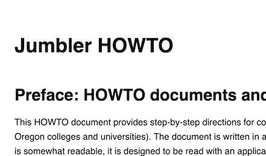
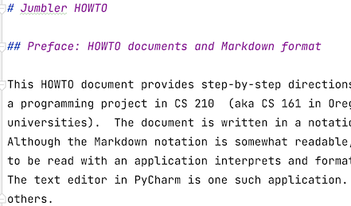
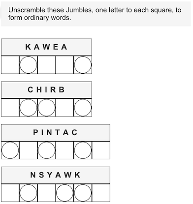

# Jumbler HOWTO

## Preface: HOWTO documents and Markdown format

This HOWTO document provides step-by-step directions for completing
a programming project in CS 210  (aka CS 161 in Oregon colleges and 
universities).  The document is written in a notation called Markdown.
Although the Markdown notation is somewhat readable, it is designed
to be read with an application interprets and formats the Markdown. 
The text editor in PyCharm is one such application.  There are many 
others. 

If you are using a Markdown-aware application, this document should 
look like this:

and not like this:

## Solving a Jumble

"The Daily Jumble" is an anagram puzzle distributed 
by Tribune Content Agency, LLC, and  published in a 
number of 
newspaper.  It is often titled 
"That scrambled word game."  
Here is an example, copyright 
Tribune Content Agency and used here 
under fair use provisions of U.S. 
Copyright Law for educational purposes:

